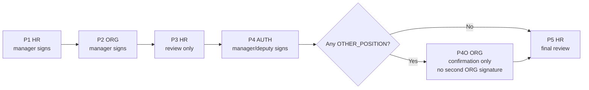
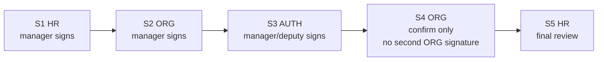
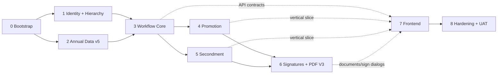

# EGAS Promotion & Secondment System - Implementation Blueprint v1.0

**Companion to:** Requirements & System Architecture Baseline v5.2  
**Purpose:** machine-readable design map for implementation agents.  
**Business rule:** when this file conflicts with the v5.2 baseline, the v5.2 baseline wins.  
**Historical repository:** `Ossawy/EGAS_Promotion-Secondment_Workflow_System` is reference-only. Do not copy old workflow behavior without checking v5.2.

## 1. Architecture freeze

```text
React 19 + TypeScript + Vite SPA
        -> same-origin HTTPS REST/JSON
Node.js 22+ + TypeScript + Express 5 modular monolith
        -> pg/node-postgres + parameterized SQL
PostgreSQL

Approved annual XLSX -> controlled stage -> validate -> explicit activate -> immutable annual snapshot
Private file storage -> signature assets + final official PDFs
No direct SAP runtime/database connection.
```

### Canonical backend modules

```text
services/api/src/
├── app.ts
├── server.ts
├── config/
├── db/
│   ├── pool.ts
│   ├── transaction.ts
│   ├── migration-runner.ts
│   ├── migrations/
│   └── repositories/
├── middleware/
│   ├── authenticate.ts
│   ├── csrf-origin.ts
│   ├── request-context.ts
│   ├── authorize.ts
│   └── error-handler.ts
├── modules/
│   ├── auth/
│   ├── admin/
│   ├── hierarchy/
│   ├── employee-data/
│   ├── import/
│   ├── reference/
│   ├── workflow/
│   ├── promotion/
│   ├── secondment/
│   ├── signatures/
│   ├── documents/
│   ├── notifications/
│   └── audit/
└── shared/
```

The historical repository already demonstrates useful Express module mounting, `pg` access, migrations, auth/session middleware, import, workflow, PDF, audit and notifications. Reuse those technical patterns only where they do not conflict with v5.2.

## 2. Core domain rules

### Operational hierarchy

- `ADMIN` accounts are administrative-only.
- `OPERATIONAL` accounts have exactly one active `UserUnitMembership`.
- `OperationalUnit.kind` is `HR`, `ORG`, or `AUTH`.
- HR has one active manager; ORG has one active manager.
- Each AUTH routing unit has its own active manager/deputy and subordinate employees.
- `UnitManagerAssignment` is the source of manager authority. Do not infer manager status from job-title text.
- Only the current unit manager and the current active WorkAssignment assignee may edit active work.
- Reassignment immediately ends the previous WorkAssignment; the previous employee keeps historical audit visibility but loses edit rights.

### Stage model

Business stage and internal work state are separate.

```text
BusinessStage: P1 P2 P3 P4 P4O P5 / S1 S2 S3 S4 S5

Internal work states:
MANAGER_INBOX
  -> ASSIGNED
  -> IN_PROGRESS
  -> MANAGER_REVIEW
  -> COMPLETED

MANAGER_REVIEW -> CORRECTION_REQUIRED -> IN_PROGRESS
Manager may assign to self and work directly.
```

Never invent P2A/P2B/P2C etc. Manager/employee loops stay inside one `StageExecution` until an inter-stage return creates a fresh execution.

### Correction / rejection

- **Internal correction:** manager -> current employee; same StageExecution.
- **Return for correction:** current manager -> previous business-stage manager; close current execution and create a new execution of the previous business stage within the same WorkflowIteration.
- **Reject:** end current iteration as rejected and route control to HR manager.
- HR manager after reject chooses exactly one:
  - **restart** -> new WorkflowIteration, starting P1/S1;
  - **cancel** -> final request status `CANCELLED`.
- Never delete/rewrite prior iterations, executions, signoffs or snapshots.

## 3. Workflow contracts

### Promotion



Per candidate:
- `decision_type = SAME_POSITION | OTHER_POSITION`.
- `OTHER_POSITION` requires `target_job_title`.
- Target position must remain in the same department/routing unit.
- `recommendation` is AUTH-controlled and stores the approved form value such as `NOMINATE / DEFER` (`ترشيح / تأجيل`).
- The whole request enters P4O if any current accepted P4 decision is `OTHER_POSITION`.
- P4O must not edit the signed P4 AUTH decision.

Official Promotion signoffs: P1 HR manager, P2 ORG manager, P4 AUTH manager/deputy.

### Secondment



- ORG enters one or more proposed position options per candidate.
- Every option stays within the same department/routing unit.
- AUTH selects exactly one valid ORG-proposed option per candidate.
- S4 may confirm/return/reject but may not silently replace the signed AUTH selection.

Official Secondment signoffs: S1 HR manager, S2 ORG manager, S3 AUTH manager/deputy.

## 4. Canonical physical schema contract

Use lowercase `snake_case` PostgreSQL names in the new repository. The clean database starts with one `001_initial_schema.sql`; do **not** import historical migrations 001-007.

### Identity / hierarchy

| Table | Key columns / constraints |
|---|---|
| `user_account` | `id PK`, `username UNIQUE`, `account_type ADMIN|OPERATIONAL`, `password_hash`, status/lockout/profile fields |
| `auth_session` | `id PK`, `user_id FK`, `token_hash UNIQUE`, CSRF hash, expiry/revocation metadata |
| `routing_unit` | `id PK`, `code UNIQUE`, `name_ar UNIQUE`, active flag |
| `operational_unit` | `id PK`, `kind HR|ORG|AUTH`, `routing_unit_id FK NULL except AUTH`, active flag. One active HR, one active ORG, one active AUTH unit per routing unit. |
| `user_unit_membership` | `id PK`, `user_id FK`, `unit_id FK`, effective dates. Partial unique: one active membership per operational user. |
| `unit_manager_assignment` | `id PK`, `unit_id FK`, `manager_user_id FK`, effective dates, assigned-by admin, replacement reason. One active manager per unit. Manager must be an active member of the same unit. |
| `user_signature_asset` | `id PK`, `user_id FK`, private storage key, MIME/size/dimensions, `sha256`, active/version history |

### Annual employee data

| Table | Key columns / constraints |
|---|---|
| `import_batch` | year, source filename/hash, detected headers JSON, status, row counts, activation timestamps |
| `employee_import_staging_row` | batch FK, source row, raw JSON, normalized fields, routing resolution, validation state/messages |
| `employee` | stable `personnel_number UNIQUE` |
| `employee_annual_snapshot` | employee FK, batch FK, `UNIQUE(snapshot_year, personnel_number)`, routing unit, name/job/department, qualification, performance/report, experience and job-tenure source values |
| `routing_unit_source_alias` | `source_label UNIQUE`, routing unit FK, active/configuration metadata |
| `job_category_reference` | approved form grouping/category reference |
| `qualification_status_reference` | approved Secondment qualification/compliance reference |

### Workflow core

| Table | Key columns / constraints |
|---|---|
| `workflow_request` | number/type/routing/status/current iteration/stage/version; creator; timestamps |
| `workflow_iteration` | request FK, iteration number, status, parent iteration, start/end/reject metadata; `UNIQUE(request_id, iteration_no)` |
| `request_form_section` | request/category/display order; unique request/category |
| `request_candidate` | request FK, employee snapshot FK, frozen initial employee fields + current accepted workflow fields; unique request/employee snapshot |
| `stage_execution` | request/iteration/stage, `execution_no`, responsible unit, status/work state, open/complete timestamps, previous execution reference. `UNIQUE(iteration_id, stage_code, execution_no)` |
| `work_assignment` | stage execution FK, assigned-by manager, assigned-to user, start/end/reason. Partial unique: one active assignment per StageExecution. |
| `stage_submission_snapshot` | `stage_execution_id UNIQUE`, immutable submitted/accepted JSON + SHA-256. Every completed stage freezes a snapshot. |
| `workflow_note` | append-only request/candidate message with iteration/execution/author/unit/stage attribution |
| `stage_action` | append-only business action with actor/unit/manager context, reason and safe payload |

### Workflow-specific data

| Table | Key columns / constraints |
|---|---|
| `promotion_decision` | stage execution FK + candidate FK; decision `SAME_POSITION|OTHER_POSITION`; target job; recommendation; notes; unique per candidate per P4 execution |
| `secondment_position_option` | candidate FK + source ORG stage execution; position title, organizational dependency, qualification status, display order |
| `secondment_decision` | AUTH stage execution FK + candidate FK + selected option FK; one decision per candidate per S3 execution |

### Signoff / documents / evidence

| Table | Key columns / constraints |
|---|---|
| `workflow_signoff` | `stage_execution_id UNIQUE`; signer user; signer name/job/role/unit/manager-assignment snapshots; signature asset/hash; signed_at. Password is never stored. |
| `final_form_snapshot` | request FK + final iteration FK; template version; immutable JSON; SHA-256; one accepted final snapshot per completed iteration |
| `frozen_pdf_document` | final snapshot FK; storage key; SHA-256; file size/materialization metadata |
| `pdf_generation_log` | request/document kind/template/success/error-safe-metadata/timestamp |
| `notification` | recipient user; request/execution refs; type/read state/timestamp |
| `audit_event` | append-only business/admin evidence; tamper-evident chain/hash if implemented |
| `security_event` | append-only security evidence; no passwords/session/CSRF secrets |

## 5. Required database invariants

1. One active operational membership per operational account.
2. One active manager per OperationalUnit.
3. AUTH OperationalUnit maps to exactly one active RoutingUnit; one active AUTH unit per RoutingUnit.
4. Current manager must be an active member of the same OperationalUnit.
5. One active WorkAssignment per StageExecution.
6. Employee command access requires the active WorkAssignment.
7. Manager command access requires the effective UnitManagerAssignment for the StageExecution responsible unit.
8. One immutable StageSubmissionSnapshot per completed StageExecution.
9. At most one WorkflowSignoff per StageExecution.
10. Signing stages are exactly P1/P2/P4 and S1/S2/S3.
11. Promotion P4 requires one current decision per active candidate before signoff.
12. Any accepted P4 `OTHER_POSITION` decision routes the whole request to P4O; otherwise P5.
13. P4O cannot mutate P4 decisions.
14. Secondment S3 requires exactly one selected valid ORG option per active candidate.
15. Reject does not restart in place: it ends the iteration and creates HR rejection control.
16. Restart creates iteration N+1; prior iteration data is immutable.
17. Inter-stage return creates a fresh StageExecution of the previous stage, preserving prior signed execution/signoff.
18. Completed request freezes `final_form_snapshot`; PDF rendering/materialization failure must not roll back or mutate workflow state.

## 6. Transaction boundaries

### Assign / reassign

Within one PostgreSQL transaction:
1. lock StageExecution;
2. verify caller is current unit manager;
3. verify target user is active member of same unit;
4. end current WorkAssignment if any;
5. insert new WorkAssignment;
6. append StageAction/AuditEvent;
7. create notification;
8. commit.

### Employee submit to manager

1. lock StageExecution + active WorkAssignment;
2. verify caller is current assignee;
3. validate stage-owned fields;
4. set work state `MANAGER_REVIEW`;
5. append evidence + manager notification;
6. commit.

### Manager internal correction

1. lock execution;
2. verify manager;
3. require reason;
4. preserve assignment (or explicitly reassign first);
5. set `CORRECTION_REQUIRED`, append action, notify assignee;
6. commit.

### Return to previous business stage

1. lock request/current iteration/current execution;
2. verify manager and transition allowed;
3. require reason;
4. close current execution;
5. create fresh StageExecution for previous business stage with next `execution_no`;
6. route to previous stage OperationalUnit manager inbox;
7. default/suggest prior employee in response DTO but do not auto-assign without manager action unless v5.2 explicitly allows it;
8. append evidence/notifications;
9. commit.

### Reject

1. lock request/iteration/current execution;
2. verify manager and reject permitted;
3. require reason;
4. close current execution + iteration as rejected;
5. set request `REJECTED_PENDING_HR_DECISION`;
6. create manager-only HR rejection review task/control record;
7. append evidence + notify HR manager;
8. commit.

### Restart / cancel

HR manager only after reject.
- Restart -> create WorkflowIteration N+1 + fresh P1/S1 StageExecution.
- Cancel -> request `CANCELLED` final.

### Sign and advance

One command; never expose generic signoff CRUD.

1. Authenticate session and validate CSRF/Origin/DTO.
2. Open DB transaction; lock current UserAccount and StageExecution.
3. Re-check account, OperationalUnit, current UnitManagerAssignment, stage/work state and required fields.
4. Verify the raw supplied password against the locked current Argon2id password hash.
5. On failure: roll back workflow writes; emit safe `SIGNATURE_PASSWORD_REJECTED` security evidence; create no signoff and no transition.
6. Freeze `stage_submission_snapshot`.
7. Resolve active signature asset and freeze signer/manager/signature snapshots.
8. Insert `workflow_signoff` (unique StageExecution).
9. Complete StageExecution and create the next StageExecution according to workflow rules.
10. Append StageAction/AuditEvent and notifications.
11. Commit.
12. Browser clears the password immediately after the single attempt.

## 7. API command surface

Do not expose generic database CRUD or a client-settable `status/stage/work_state` endpoint.

### Auth
- `POST /api/auth/login`
- `POST /api/auth/logout`
- `POST /api/auth/change-password`
- `GET /api/auth/me`

### Admin / hierarchy
- `GET|POST /api/admin/accounts`
- `PATCH /api/admin/accounts/:id`
- `GET|POST /api/admin/operational-units`
- `POST /api/admin/operational-units/:unitId/memberships`
- `POST /api/admin/operational-units/:unitId/manager-assignments`
- `POST /api/admin/manager-assignments/:id/end`
- routing/source-alias/reference/import administration endpoints

### Workflow core
- `POST /api/workflow/requests`
- `GET /api/workflow/requests`
- `GET /api/workflow/requests/:id`
- candidate add/remove while permitted
- `GET /api/workflow/manager/inbox`
- `GET /api/workflow/my-work`
- `POST /api/workflow/stages/:id/assign`
- `POST /api/workflow/stages/:id/take`
- `POST /api/workflow/stages/:id/submit-to-manager`
- `POST /api/workflow/stages/:id/internal-correction`
- `POST /api/workflow/stages/:id/return-previous`
- `POST /api/workflow/stages/:id/reject`
- `POST /api/workflow/stages/:id/approve-and-advance`
- `POST /api/workflow/stages/:id/sign-and-advance`
- `POST /api/workflow/requests/:id/restart`
- `POST /api/workflow/requests/:id/cancel`
- notes/timeline/history endpoints

### Promotion
- stage-specific P2 preparation commands
- `PUT /api/promotion/stages/:stageExecutionId/candidates/:candidateId/decision`
- P4O confirmation uses workflow approve/return/reject commands; it never exposes P4 decision mutation.

### Secondment
- position option commands at S2
- `PUT /api/secondment/stages/:stageExecutionId/candidates/:candidateId/selection` at S3
- S4 confirmation uses workflow approve/return/reject commands and cannot silently replace S3 selection.

### Documents
- `GET /api/documents/requests/:requestId/current.pdf`
- `GET /api/documents/requests/:requestId/final.pdf`
- `GET /api/documents/requests/:requestId/audit.pdf`

## 8. Authorization decision contract

Every object request is server-authorized from authenticated context; never trust user/role/unit identifiers supplied by the browser.

Manager-only mutation requires:

```text
session valid
AND account_type = OPERATIONAL
AND active membership exists
AND membership.unit_id = StageExecution.responsible_unit_id
AND active UnitManagerAssignment(unit_id, manager_user_id = current user)
AND command allowed in current business stage/work state
```

Employee mutation requires:

```text
session valid
AND account_type = OPERATIONAL
AND active membership exists
AND membership.unit_id = StageExecution.responsible_unit_id
AND active WorkAssignment(stage_execution_id, assigned_to_user_id = current user)
AND command allowed in current business stage/work state
```

Admin account does not inherit operational workflow authority.

## 9. PDF contract

- Current/Draft PDF: rendered on demand from current authorized state; not immutable evidence.
- Final PDF: one immutable official PDF after P5/S5 completion and all required fields/signoffs.
- Promotion template: `EGAS-OFFICIAL-PROMOTION-AR-3.0`.
- Official signers: HR manager + ORG manager + AUTH manager/deputy.
- Later HR/ORG reviews do not create duplicate official signatures.
- Store final source snapshot + template version + hashes so later data/account/template changes cannot rewrite evidence.
- Separate audit PDF contains detailed actor/action/timestamp evidence.

## 10. Historical repository reuse policy

### Reuse/adapt after review
- DB pool/transaction/migration-runner patterns.
- Express app/middleware structure and centralized safe errors.
- Local Argon2id auth/session/CSRF/Origin patterns.
- Annual XLSX staging/validation/activation approach.
- Append-only audit/security event patterns.
- Signature image canonicalization/private storage.
- PDF rendering safety and bounded generation.
- Notification ownership/read state.

### Redesign
- role/account model -> `account_type + UserUnitMembership + UnitManagerAssignment`.
- authority assignments -> AUTH `OperationalUnit` per RoutingUnit + manager assignment.
- shared Organization claim -> manager inbox + WorkAssignment.
- StageTask -> StageExecution + WorkAssignment + StageSubmissionSnapshot.
- signoff uniqueness -> unique by StageExecution, allowing correction executions to be re-signed without rewriting history.
- correction/reject/restart transitions.
- P4O trigger -> any same-department `OTHER_POSITION`, not cross-routing.
- official PDF -> V3 three-signer form.

### Never carry forward into the clean v5 database
- historical migrations `001` through `007`.
- multi-role active-role switching.
- shared Organization claim queue.
- cross-routing P4O target behavior.
- immutable received-PDF-per-actor requirement.
- V2 official-form column/signature contract.

## 11. Implementation phases and dependency gates



### Agent work-package rule

Each implementation agent receives only:
1. v5.2 baseline sections relevant to its phase;
2. this blueprint sections relevant to its phase;
3. exact current migration/schema files for the **new** repository;
4. exact module/API docs for dependencies already implemented;
5. tests/definition-of-done for its phase.

Do not feed the full historical project conversation to an implementation agent.

### Phase exit gates

| Phase | Agent must produce before next phase |
|---|---|
| 0 | repo skeleton, CI, env example, migration runner, least-privilege DB bootstrap, build/test/typecheck |
| 1 | account/hierarchy migrations + Admin APIs + manager replacement + authz tests |
| 2 | v5 XLSX mapping/validation/activation + synthetic snapshot tests |
| 3 | request/iteration/execution/assignment engine + correction/reject/restart + concurrency/IDOR tests + stable API docs |
| 4 | Promotion P1-P5/P4O end-to-end + decision/signoff rules + tests |
| 5 | Secondment S1-S5 end-to-end + position selection + tests |
| 6 | signature reauth + final snapshots + PDF V3 + audit PDF + visual Arabic QA |
| 7 | React RTL workspaces wired to stable APIs; no security logic only in frontend |
| 8 | load/browser/accessibility/backups/security/UAT gates |

## 12. Non-negotiable coding rules

- Business rules live in domain services; route handlers stay thin.
- Every SQL statement is parameterized.
- Acquire one `pg` client per transaction and keep the entire atomic operation on that client.
- Use database conditional writes/row locks/constraints for concurrency; no process-only mutex for correctness.
- Never expose generic state mutation endpoints.
- Never union permissions from old roles or infer authority from job-title text.
- Never rewrite an applied migration.
- Never store/log signoff passwords.
- Never overwrite a completed StageSubmissionSnapshot, WorkflowSignoff, iteration, AuditEvent or final document.
- Frontend visibility is not an authorization boundary.
- PDF failure cannot mutate workflow state.
- Synthetic data only in automated tests; no real HR data/signatures/passwords committed to Git.
